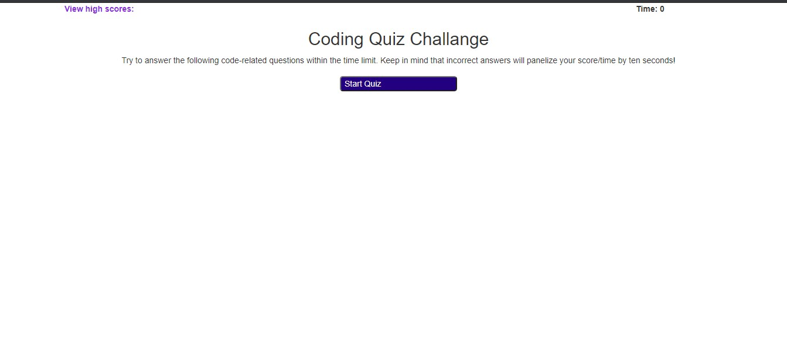
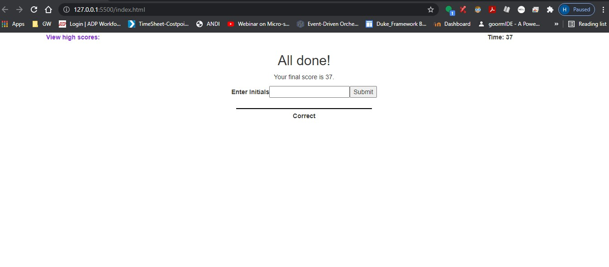
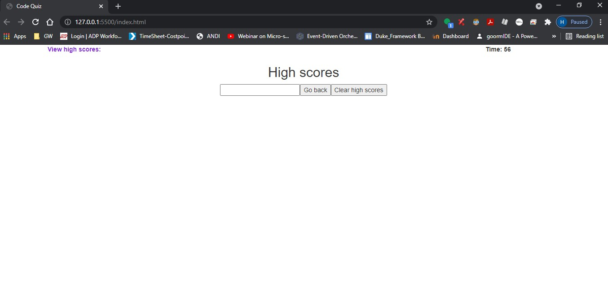

# codequiz
https://github.com/hikod/codequiz
https://hikod.github.io/codequiz/

Tools: Bootstrap,JavaScript, HTML, CSS.

AS A coding boot camp student
I WANT to take a timed quiz on JavaScript fundamentals that stores high scores
SO THAT I can gauge my progress compared to my peers

Description: user takes a timed quiz and the user time is substracted based on the wrong answer. user can also see the result and save the result.

