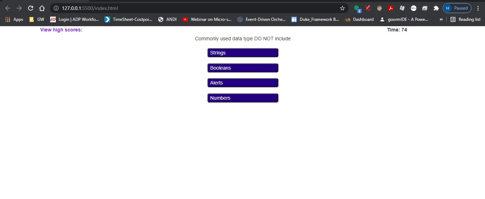

# codequiz
https://github.com/hikod/codequiz
https://hikod.github.io/codequiz/

Tools: Bootstrap,JavaScript, HTML, CSS.
Description: Based on user input, the city's current and future conditions of the weather are displayed

